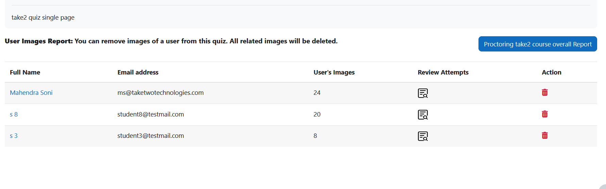
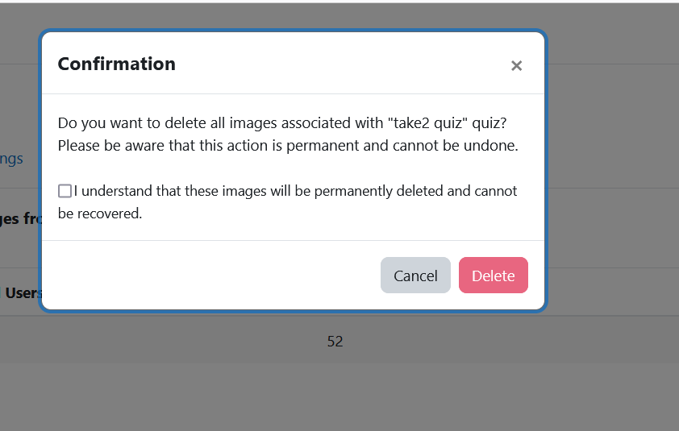

6. Data Protection and Privacy
===========================

The plugin securely stores captured data (images and information) locally on your Moodle server, ensuring it stays within your institution's infrastructure. Take2 Technologies does not have access to or store any of your data.

Image Storage Options
-------------------
By default, only images that trigger warnings are stored. However, administrators and teachers can choose to store all captured images for a specific quiz by enabling this option in the quiz settings.

Automatic Deletion Period
-----------------------
Institutions can set a specific time period for how long the images and data will be kept before they are automatically deleted. You can choose from the following options: **Never, 1 Month, 3 Months, 6 Months, or 1 Year**. By default, the images are kept indefinitely unless you decide to set a time limit.

Hard Delete
----------
When the time period expires, the images will be permanently deleted from the system. Once they are deleted, they cannot be recovered. Administrators can adjust this setting in the Proctoring Quiz Access Rule settings.

Manual Deletion Options
---------------------
Institutions also have the option to manually delete images linked to specific courses, quizzes, or students. To do this, follow these steps:

1. Go to the **Proctoring Report** within the quiz.

2. Click on the delete icon next to the images you want to remove.

3. You will see a confirmation box asking for your consent to permanently delete the images. To proceed, you must check the consent box; otherwise, the delete button will remain disabled. Once confirmed, the images will be permanently removed and cannot be restored.

4. There are three types of deletions you can perform:

   * **Course Delete**
     * Removes all proctoring images associated with a specific course.
   
   * **Quiz Delete**
     * Removes all proctoring images associated with a specific quiz.
   
   * **Student Delete**
     * Removes all proctoring images related to a particular student.

This manual deletion process only affects the proctoring images and does not impact any other data.
