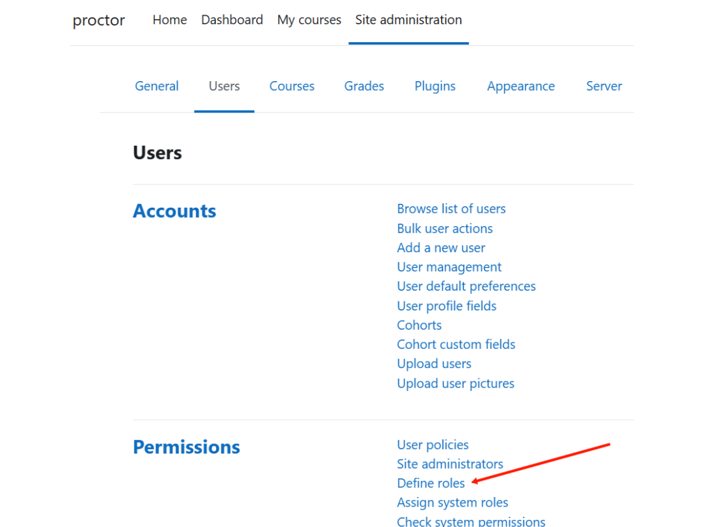
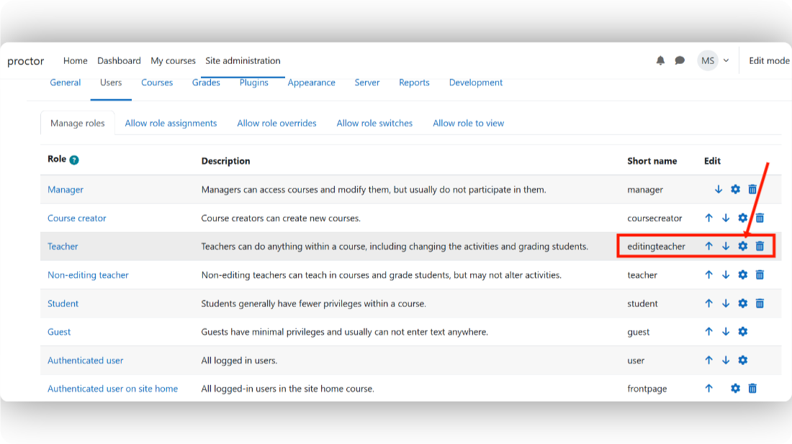
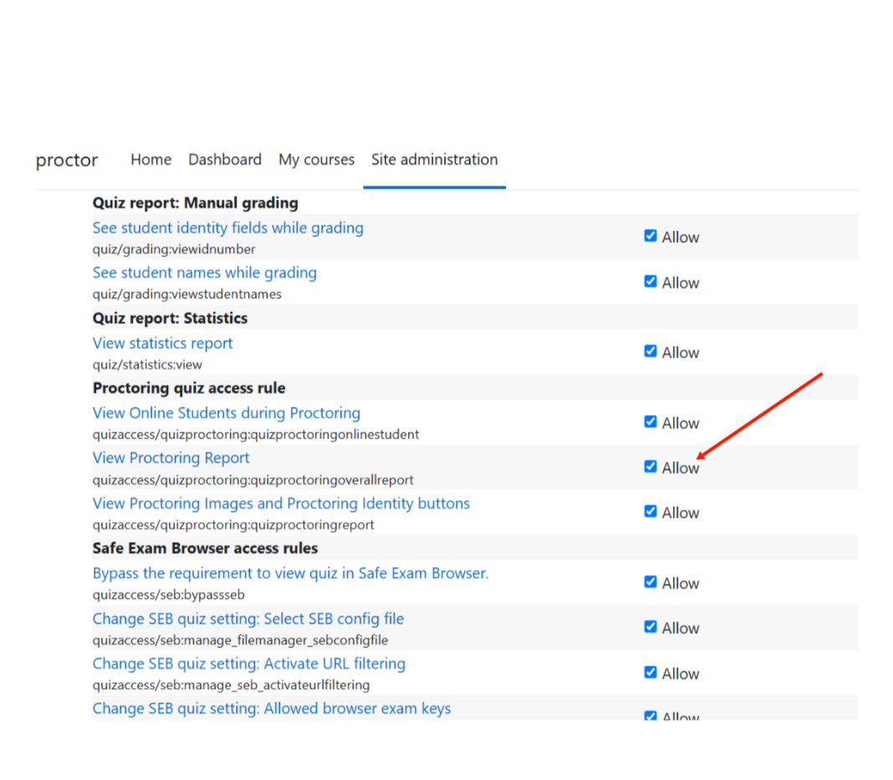
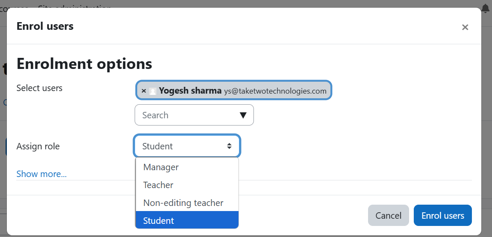

4. How Permissions Can Be Assigned in Moodle
==========================================

In Moodle, administrators can assign or modify permissions for different roles (e.g., teachers, students) to control who can access and use specific features of the Moodle Proctoring plugin. Below are the steps to assign permissions.

Step 1: Access Role Definitions
-----------------------------
1. Log in as an Administrator
   
   * Only Moodle administrators have the ability to change permissions.

2. Navigate to Site Administration
   
   * On the Moodle dashboard, click on **Site administration** from the menu.

3. Go to the Define Roles Section
   
   * In the Site Administration panel, find **Users** → **Permissions** → **Define roles**.

Step 2: Edit Existing Roles or Create a New Role
---------------------------------------------
Modify an Existing Role (e.g., Teacher, Student):

* From the list of existing roles (Teacher, Student, Administrator), click the **edit icon** next to the role you want to adjust.

* Search for the specific proctoring-related permissions you want to assign (e.g., quizaccess/quizproctoring)

Step 3: Assign Proctoring Permissions
----------------------------------
Find Proctoring-Related Capabilities
^^^^^^^^^^^^^^^^^^^^^^^^^^^^^^^^^^
Use the search bar in the role editing page to locate permissions related to the Moodle Proctoring plugin. Some key permissions include:

* ``quizaccess/quizproctoring:quizproctoringonlinestudent``
    * Allows the user to view students online during proctored quizzes in real time.

* ``quizaccess/quizproctoring:quizproctoringoverallreport``
    * Allows the user to view a comprehensive proctoring report of the quiz, including any suspicious activities detected.

* ``quizaccess/quizproctoring:quizproctoringreport``
    * Grants access to view proctoring images and proctoring identity buttons for detailed review of student identity verification.

Permission Settings
^^^^^^^^^^^^^^^^^
For each of these capabilities, you can either:

* Check **Allow** to grant access to specific proctoring features
* Leave unchecked to Disallow access

Step 4: Assign Roles to Users
---------------------------
Once permissions are set for a role, you can assign the role to users within a course:

1. Go to the Course
   
   * Navigate to the course where you want to assign the role.

2. Open the Participants Page
   
   * In the course, go to **Participants** from the course menu.

3. Enroll the User
   
   * Click the **Enroll Users** button
   * In the enrollment pop-up, search for the user(s) you want to assign the role to.

4. Assign a Role
   
   * From the drop-down menu next to the user's name, select the appropriate role
   * Click **Enroll Users** to assign the role

