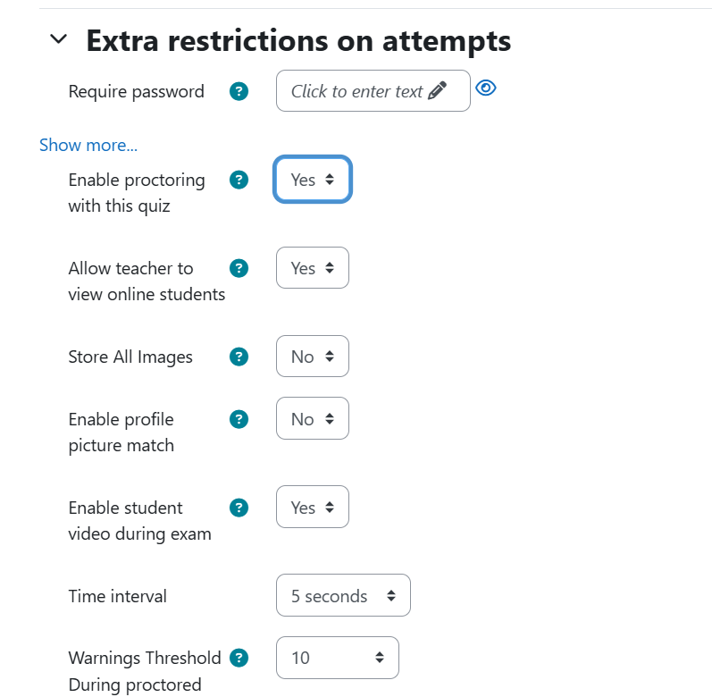
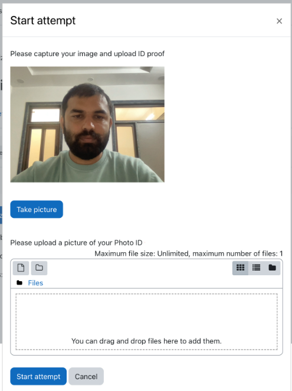

5. User Experience
================

Interface
--------

Instructor Interface
^^^^^^^^^^^^^^^^^
The proctoring settings are integrated into Moodle's quiz management interface. Instructors can access this by navigating to the specific quiz they wish to configure. They will find options related to proctoring under the "Quiz settings" menu.

Student Interface
^^^^^^^^^^^^^^^
When students attempt a proctored quiz, they will encounter a dedicated proctoring environment. This interface prompts them for webcam access before starting the quiz, ensuring that all necessary permissions are granted for monitoring.

Workflow
-------

For Instructors
^^^^^^^^^^^^^
1. **Enable Proctoring**
   
   To enable proctoring for a specific quiz, navigate to the course where the quiz is located. Click on the quiz, and click on "Settings."

2. **Configure Proctoring Settings**
   
   In the quiz settings, find the "Extra restrictions on attempts" section. Here, you can toggle the proctoring option to "Yes." You will also set capture image intervals and define warning thresholds.

3. **Set Capture Intervals**
   
   Specify how often the plugin should capture images of the student during the quiz. This setting is essential for monitoring student activity.

4. **Review Captured Data**
   
   After the quiz is completed, instructors can review the captured images and any warnings issued. This is done by navigating to the quiz results page and selecting the "Review attempts" option. Here, instructors can see all images, including those that triggered warnings, allowing for a thorough assessment of the quiz's integrity.

5. **Live Monitoring**
   
   During the quiz, instructors can also view students live. This is accessible from the quiz monitoring interface, allowing for real-time oversight.

For Students
^^^^^^^^^^^
1. **Accessing the Proctored Quiz**
   
   Students will find the proctored quiz listed in their course under the relevant topic or section. When they click on the quiz link, they will be directed to a page that outlines the quiz details.

2. **Webcam Activation**
   
   Before starting the quiz, students must allow webcam access. This step is crucial for identity verification and monitoring.

3. **Initial Image Capture**
   
   After activating the webcam, students will be required to capture an initial image of themselves. If the image is clear and properly framed, they will be allowed to begin the quiz attempt.

4. **Taking the Quiz**
   
   Once they have successfully captured their initial image, students can start the quiz. Throughout the quiz, multiple images will be captured based on the time interval set by the instructor. These images will be compared with the initial image to ensure that the correct individual is taking the quiz.

5. **Monitoring**
   
   Students should be aware that their activity is being monitored, and any suspicious behavior may trigger warnings.

6. **Post-Quiz Review**

   After completing the quiz, students will not have access to their captured images or warnings, as these are reserved for instructors. However, they can check their quiz results and feedback in the usual manner.
